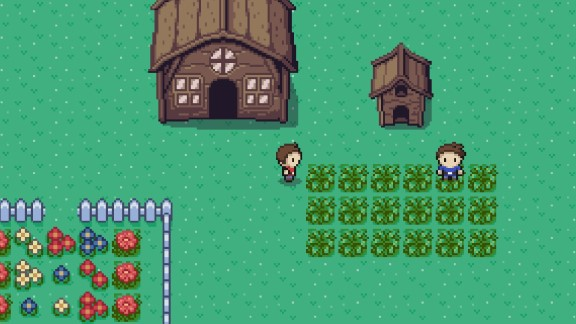
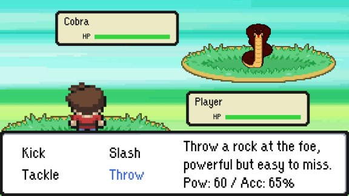

# Unity 2D Demo - A New Adventure
The game I submitted as my end-term project for the Unity 2D module at Green IT Academy, with a lot of updates since then.

**Assets**, **Packages** and **ProjectSettings** folders are for Unity. **DEMO_A_New_Adventure** folder is for quick play without the need to load Unity.

*Get out of the house, talk to the NPC then go north. The bush near the NPC has no enemies, the bush near the dog has enemies.*

## 🕹 Controls:
- **WASD** for movement and choosing options
- **Enter** for interact (talk), select option
- **Esc** for opening Option menu

## 🎮 Features:
- Controlled Random encounter
- Battle system, AI
- Dialogue system
- Menu system
- Audio

## 🛑 *Development process stopped at returning the dog to its owner*

Demo video: https://youtu.be/SK5axNjGQiY

