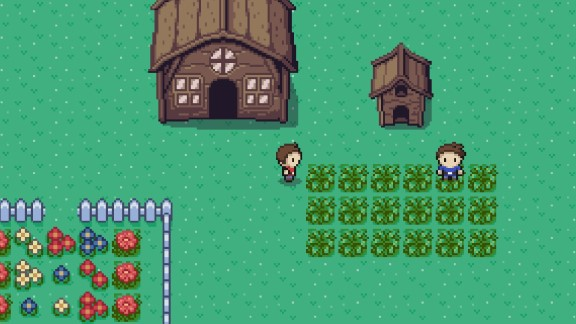
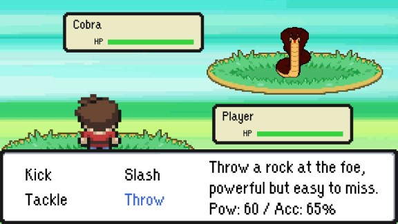
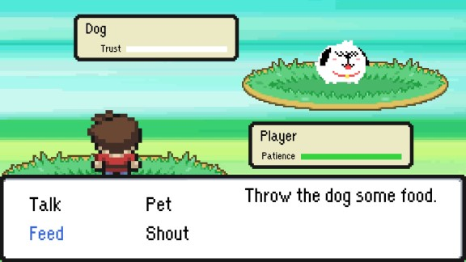

# Unity 2D project
The game I submitted as my end-term project for the Unity 2D module at Green IT Academy. The bush near the NPC has no enemies, the bush near the dog has enemies.

*Get out of the house, talk to the NPC then go north*

## 🕹 Controls:
- WASD for movement and choosing options
- Enter for interact (talk), select option
- Esc for exit

## 🎮 Features:
- Controlled Random encounter
- Battle system, AI
- Dialogue system

## 🛑 *Development process stopped at finishing befriending the dog*

